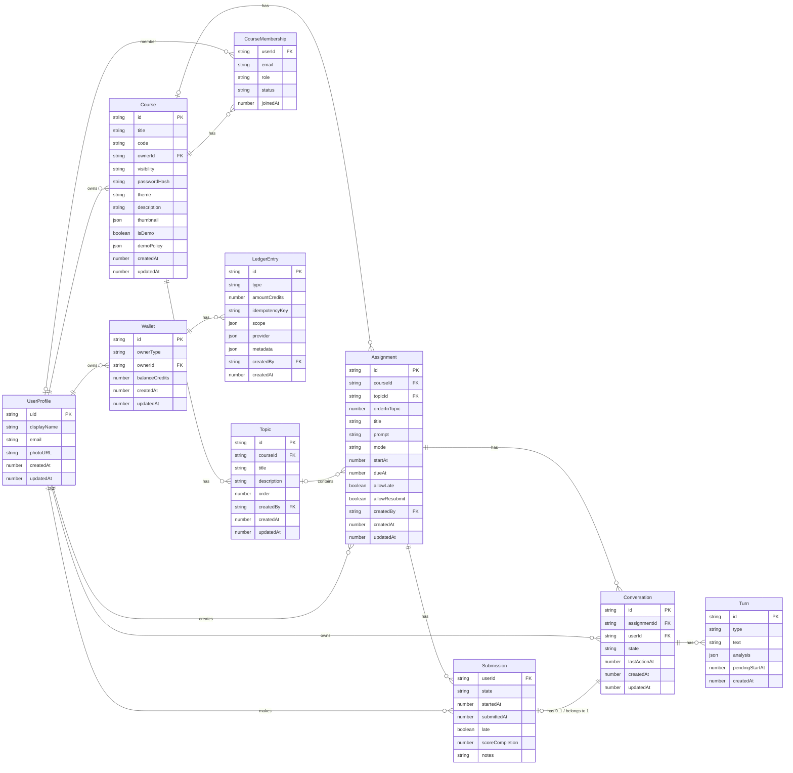

# Mentora's Firebase Configuration

## Firestore

### Data model

| #   | Relationship                   | Cardinality | Description                                    |
| --- | ------------------------------ | ----------- | ---------------------------------------------- |
| 1   | UserProfile → Course           | 1 → N       | Instructor owns courses                        |
| 2   | Course → CourseMembership      | 1 → N       | Course has many members                        |
| 3   | UserProfile → CourseMembership | 0..1 → N    | User participates in many courses              |
| 4   | Course → Assignment            | 0..1 → N    | Course can have multiple assignments           |
| 5   | UserProfile → Assignment       | 1 → N       | Instructor creates assignments                 |
| 6   | Assignment → Submission        | 1 → N       | Assignment has many submissions                |
| 7   | UserProfile → Submission       | 1 → N       | Student submits many assignments               |
| 8   | Assignment → Conversation      | 1 → N       | Assignment has many conversations              |
| 9   | UserProfile → Conversation     | 1 → N       | Student has many conversations                 |
| 10  | Conversation → Turn            | 1 → N       | Conversation contains multiple turns, embedded |
| 11  | Submission ↔ Conversation     | 0..1 ↔ 1   | Each submission may link to one conversation   |

> Note: Since our platform helps people learn to reshape their thinking through conversation and reflection, a `Conversation` itself becomes the submission for an assignment once it's completed.

### Schema conventions

- Optional Firestore fields that may be missing or cleared are modeled with `nullable().optional().default(null)` to:
    - allow documents that omit the field (optional)
    - allow explicit clearing with `null` (nullable)
    - normalize `undefined` to `null` in app code (default)

### Indexes

The indexes are defined in `sync/firestore.indexes.json`.

#### Assignments

1. List course assignments newest first
    - **Query**: `where("courseId", "==", courseId).orderBy("startAt", "desc")`
    - **Index**: `(courseId ASC, startAt DESC)`
2. List course assignments oldest first
    - **Query**: `where("courseId", "==", courseId).orderBy("startAt", "asc")`
    - **Index**: `(courseId ASC, startAt ASC)`
3. Created by instructor, admin view
    - **Query**: `where("createdBy","==",uid).orderBy("createdAt","desc")`
    - **Index**: `(createdBy ASC, createdAt DESC)`
4. List assignments by topic
    - **Query**: `where("topicId", "==", topicId).orderBy("orderInTopic", "asc")`
    - **Index**: `(topicId ASC, orderInTopic ASC)`

#### Topics

1. List course topics ordered
    - **Query**: `where("courseId", "==", courseId).orderBy("order", "asc")`
    - **Index**: `(courseId ASC, order ASC)`

#### Submissions

1. Per-assignment grading queue
    - **Collection**: `assignments/{aid}/submissions`
    - **Query**: `where("state","in",["submitted","graded_complete"]).orderBy("submittedAt","desc")`
    - **Index**: `(state ASC, submittedAt DESC)`
2. Per-assignment filter by state then recent work
    - **Query**: `where("state","==",state).orderBy("startedAt","desc")`
    - **Index**: `(state ASC, startedAt DESC)`
3. Collection group: all submissions by a student (cross-course)
    - **Collection group**: `submissions`
    - **Query**: `where("userId","==",uid).orderBy("startedAt","desc")`
    - **Index**: `(userId ASC, startedAt DESC)`
4. Collection group: all late items (admin/instructor)
    - **Query**: `where("late","==",true).orderBy("submittedAt","desc")`
    - **Index**: `(late ASC, submittedAt DESC)`

#### Conversations

1. Unique lookup: assignment + user
    - **Query**: `where("assignmentId","==",aid).where("userId","==",uid)`
    - **Index**: `(assignmentId ASC, userId ASC)`
2. Recent conversations for a user
    - **Query**: `where("userId","==",uid).orderBy("updatedAt","desc")`
    - **Index**: `(userId ASC, updatedAt DESC)`
3. Assignment conversations by activity
    - **Query**: `where("assignmentId","==",aid).orderBy("updatedAt","desc")`
    - **Index**: `(assignmentId ASC, updatedAt DESC)`

#### Courses & Roster

1. Instructor courses
    - **Query**: `where("ownerId","==",uid).orderBy("createdAt","desc")`
    - **Index**: `(ownerId ASC, createdAt DESC)`
2. Public courses (discovery)
    - **Query**: `where("visibility","==","public").orderBy("createdAt","desc")`
    - **Index**: `(visibility ASC, createdAt DESC)`
3. Roster filter by role
    - **Collection**: `courses/{courseId}/roster`
    - **Query**: `where("role","in",["student","ta"]).orderBy("joinedAt","desc")`
    - **Index**: `(role ASC, joinedAt DESC)`
4. Find all courses a user is in (collection group)
    - **Collection group**: `roster`
    - **Query**: `where("userId","==",uid).orderBy("joinedAt","desc")`
    - **Index**: `(userId ASC, joinedAt DESC)`
5. Find all active courses a user is enrolled in
    - **Collection group**: `roster`
    - **Query**: `where("userId","==",uid).where("status","==","active").orderBy("joinedAt","desc")`
    - **Index**: `(userId ASC, status ASC, joinedAt DESC)`

### Security rules

The security rules are defined in `sync/firestore.rules`.

- Authentication: most reads/writes require `request.auth != null` (helper `isSignedIn`).
- Course membership: `courses/{courseId}/roster/{uid}` documents represent membership and are used to gate access via helper functions `isCourseMember`, `membershipDoc`, and `hasRole`.
- Roles: members may be `student`, `ta`, or `instructor`. Helper predicates `isTA`, `isStudent`, and `isInstructorOfCourse` are provided.

Per-collection behaviour (high level):

- `users/{uid}`: users can read/create/update their own profile only; deletes are disallowed to keep profiles intact.
- `courses/{courseId}`: readable by any signed-in course member or the owning instructor; creation is open to signed-in users; updates/deletes are restricted to the owning instructor or an instructor listed in the roster. **Public courses** are readable by anyone (including unauthenticated users).
- `courses/{courseId}/roster/{memberId}`: roster rows may be read by the roster member themselves or any course member; create/update/delete of roster rows is restricted to instructors (or the course owner).
- `topics/{topicId}`: readable if the parent course is public (by anyone) or if the user is a course member. Creation/update/delete restricted to instructors/TAs.
- `assignments/{aid}`: readable by course members for course-bound assignments, or by the creator for standalone assignments. Creation/update/delete requires instructor/TA privileges for course assignments or the original creator for standalone assignments. Submissions subcollection: students may create their own submission (must be in `in_progress` state initially) and update it while it's `in_progress` or transition it to `submitted`. Once submitted, students can no longer change the state but instructors/TAs can. Instructors/TAs may read and update all submissions for grading. Deletion is restricted to instructors.
- `conversations/{cid}`: readable by the owning student or instructors/TAs of the linked assignment's course. Students may create conversations where `userId == request.auth.uid`. Updates may be performed by the student or by instructors/TAs (e.g., to close conversations). Deletions are disallowed.
- `wallets/{walletId}`: readable only by the wallet owner (user or host). Write operations are disallowed (server-side only).
- `wallets/{walletId}/entries/{entryId}`: readable only by the wallet owner. Write operations are disallowed (server-side only).

#### Safety and implementation notes

- Rules use defensive reads (exists/get) against `assignments/{id}` and `courses/{id}` to safely resolve related course IDs before checking roles.
- There's an explicit fallback match `/{document=**}` that denies all reads and writes by default; this ensures unhandled collections are closed.
