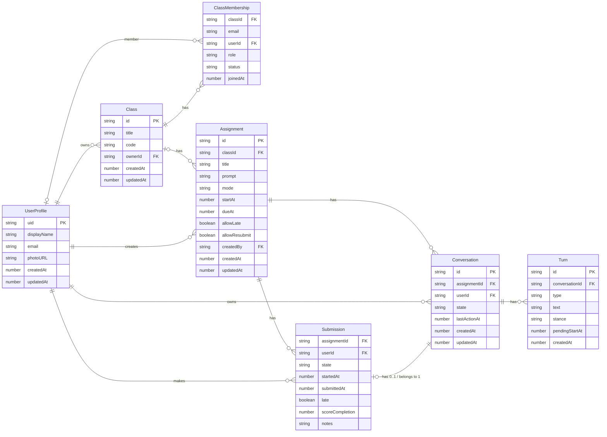

# Mentora's Firebase Configuration

## Firestore

### Data model

| #   | Relationship                  | Cardinality | Description                                    |
| --- | ----------------------------- | ----------- | ---------------------------------------------- |
| 1   | UserProfile → Class           | 1 → N       | Instructor owns classes                        |
| 2   | Class → ClassMembership       | 1 → N       | Class has many members                         |
| 3   | UserProfile → ClassMembership | 0..1 → N    | User participates in many classes              |
| 4   | Class → Assignment            | 0..1 → N    | Class can have multiple assignments            |
| 5   | UserProfile → Assignment      | 1 → N       | Instructor creates assignments                 |
| 6   | Assignment → Submission       | 1 → N       | Assignment has many submissions                |
| 7   | UserProfile → Submission      | 1 → N       | Student submits many assignments               |
| 8   | Assignment → Conversation     | 1 → N       | Assignment has many conversations              |
| 9   | UserProfile → Conversation    | 1 → N       | Student has many conversations                 |
| 10  | Conversation → Turn           | 1 → N       | Conversation contains multiple turns, embedded |
| 11  | Submission ↔ Conversation    | 0..1 ↔ 1   | Each submission may link to one conversation   |

> Note: Since our platform helps people learn to reshape their thinking through conversation and reflection, a `Conversation` itself becomes the submission for an assignment once it’s completed.

### Indexes

The indexes are defined in `sync/firestore.indexes.json`.

#### Assignments

1. List class assignments newest first
    - **Query**: `where("classId", "==", classId).orderBy("startAt", "desc")`
    - **Index**: `(classId ASC, startAt DESC)`
2. Created by instructor, admin view
    - **Query**: `where("createdBy","==",uid).orderBy("createdAt","desc")`
    - **Index**: `(createdBy ASC, createdAt DESC)`
3. Available assignments (already started)
    - **Query**: `where("classId","==",classId).where("startAt","<=", now).orderBy("startAt","desc")`
    - **Index**: `(classId ASC, startAt DESC)`

#### Submissions

1. Per-assignment grading queue
    - **Collection**: `assignments/{aid}/submissions`
    - **Query**: `where("state","in",["submitted","graded_complete"]).orderBy("submittedAt","desc")`
    - **Index**: `(state ASC, submittedAt DESC)`
2. Per-assignment filter by state then recent work
    - **Query**: `where("state","==",state).orderBy("startedAt","desc")`
    - **Index**: `(state ASC, startedAt DESC)`
3. Collection group: all submissions by a student (cross-class)
    - **Collection group**: `submissions`
    - **Query**: `where("userId","==",uid).orderBy("startedAt","desc")`
    - **Index**: `(userId ASC, startedAt DESC)`
4. Collection group: all late items (admin/instructor)
    - **Query**: `where("late","==",true).orderBy("submittedAt","desc")`
    - **Index**: `(late ASC, submittedAt DESC)`

#### Conversations

1. Unique lookup: assignment + user
    - **Query**: `where("assignmentId","==",aid).where("userId","==",uid)`
    - **Index**: `(assignmentId ASC, userId ASC)`
2. Recent conversations for a user
    - **Query**: `where("userId","==",uid).orderBy("updatedAt","desc")`
    - **Index**: `(userId ASC, updatedAt DESC)`
3. Assignment conversations by activity
    - **Query**: `where("assignmentId","==",aid).orderBy("updatedAt","desc")`
    - **Index**: `(assignmentId ASC, updatedAt DESC)`

#### Classes & Roster

1. Instructor classes
    - **Query**: `where("ownerId","==",uid).orderBy("createdAt","desc")`
    - **Index**: `(ownerId ASC, createdAt DESC)`
2. Roster filter by role
    - **Collection**: `classes/{classId}/roster`
    - **Query**: `where("role","in",["student","ta"]).orderBy("joinedAt","desc")`
    - **Index**: `(role ASC, joinedAt DESC)`
3. Find all classes a user is in (collection group)
    - **Collection group**: `roster`
    - **Query**: `where("userId","==",uid).orderBy("joinedAt","desc")`
    - **Index**: `(userId ASC, joinedAt DESC)`

### Security rules

The security rules are defined in `sync/firestore.rules`.

- Authentication: most reads/writes require `request.auth != null` (helper `isSignedIn`).
- Class membership: `classes/{classId}/roster/{uid}` documents represent membership and are used to gate access via helper functions `isClassMember`, `membershipDoc`, and `hasRole`.
- Roles: members may be `student`, `ta`, or `instructor`. Helper predicates `isTA`, `isStudent`, and `isInstructorOfClass` are provided.

Per-collection behaviour (high level):

- `users/{uid}`: users can read/create/update their own profile only; deletes are disallowed to keep profiles intact.
- `classes/{classId}`: readable by any signed-in class member or the owning instructor; creation is open to signed-in users; updates/deletes are restricted to the owning instructor or an instructor listed in the roster.
- `classes/{classId}/roster/{memberId}`: roster rows may be read by class members; create/update/delete of roster rows is restricted to instructors (or the class owner). A user may always read their own roster row.
- `assignments/{aid}`: readable by class members for class-bound assignments, or by the creator for standalone assignments. Creation/update/delete requires instructor/TA privileges for class assignments or the original creator for standalone assignments.
    - `assignments/{aid}/submissions/{userId}`: students may create their own submission and update it while it's `in_progress`. Instructors/TAs may read and update submissions for grading (move to `graded_complete`). Deletion is restricted to instructors.
- `conversations/{cid}`: readable by the owning student or instructors/TAs of the linked assignment's class. Students may create conversations where `userId == request.auth.uid`. Updates may be performed by the student or by instructors/TAs (e.g., to close conversations). Deletions are disallowed.

#### Safety and implementation notes

- Rules use defensive reads (exists/get) against `assignments/{id}` and `classes/{id}` to safely resolve related class IDs before checking roles.
- There's an explicit fallback match `/{document=**}` that denies all reads and writes by default; this ensures unhandled collections are closed.
